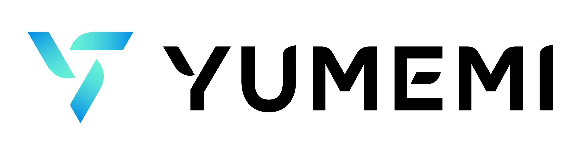

# 株式会社ゆめみの紹介

<!-- 
この会社紹介は2024年10月21日時点での紹介文です。時間経過または制度変更されたら、広報に内容を確認してください。
https://www.notion.so/yumemi/c4025f76bd4e472e92e488e2d8c61880
-->

<!-- textlint-disable -->
<!-- markdownlint-disable -->

ゆめみは京都大学大学院に在学中だった代表の片岡が研究室の仲間と共に2000年に創業したベンチャーです。

AIやIoTなど最先端の技術領域の研究に精力的に取り組み、これまで600社・6000万MAU（Monthly Active User）に上る大規模なインターネットサービスを世の中に送り出してきました。一般的に多くの人がイメージする「受託開発会社」とはアプローチが異なり、「BnB2C」（ビー・アンド・ビー・トゥー・シー）と名付けたビジネスモデルで、顧客企業のデジタル変革を支援する中で、顧客企業がエンジニア組織、デザイン組織を確立して「内製化支援」を行なっている点が特徴です。これはクライアントと開発会社という下請け構造ではなく、クライアントと共に企画・開発し（B&B）、最終消費者（C）へサービスを届けるという形で顧客の内製チームの一員として作って終わりではなく、運用も手がけ、エンドユーザーの声も反映しながらブラッシュアップを続けながら顧客と同じ目線のパートナーとして伴走します。マラソンにたとえると、コーチがマラソン選手と一緒に走りながら声をかけたりアドバイスしながら一緒に走るコーチ役を行うイメージです。

ゆめみは10年以上前から内製化支援を行う業界のリーディングカンパニーで、事業としても創業から20年間黒字・増収を続けています。内製化支援により「アウトソーシングの時代を終わらせる」ことをミッションに掲げ、中期ビジョンとしては1000社・1億MAUを目指しています。

ゆめみは創業以来一貫して増収を続けており、現在約400人の体制を1000人規模にまで拡大していく計画です。一方で、大手SIerなどにありがちなピラミッド構造をとらず、アート、デザイン、エンジニアリングのそれぞれの職能集団が並列に共存・連携し、プロジェクトごとに多様な職種のメンバーが結集する柔軟な開発体制をとり、成長環境No.1を目指しています。1000人規模になれば、哲学者、心理学者、大道芸人など多様で幅広いタレントが揃うことで、機動的に顧客企業の内製化支援に必要な役割が担えるはずです。そのために圧倒的な成長環境を重視しており、在宅リモートワーク、フルフレックス制を無期限で全社標準としており、全員CEO、給与自己決定、有給取り放題、フルリモし放題、ワークフルライフ、10％ルール、副業し放題、社員借り放題など数々のユニークな制度があります。

これらの制度の根底にあるのは「人こそすべて」という考え方です。ゆめみの事業は、常に「人」が生み出し続けているものだからこそ「人」の成長にすべてを賭けています。一人ひとりが自由に裁量を持って働き、成長を後押しすることを目的に勤務時間や給与、休日など多くのことを自ら決めることができる裁量の大きさが特徴で、自らのキャリアを強く意識し、高い成長意欲がある人にはピッタリの環境があります。

<!-- markdownlint-enable -->
<!-- textlint-enable -->
